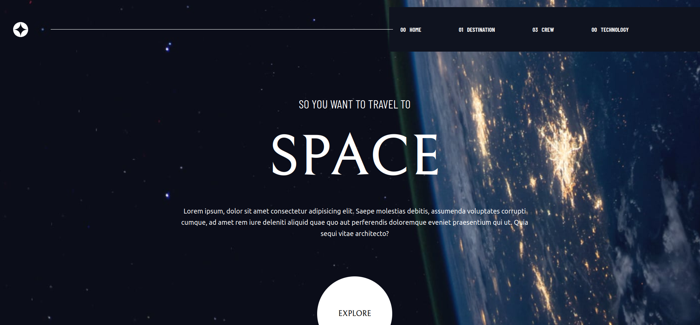
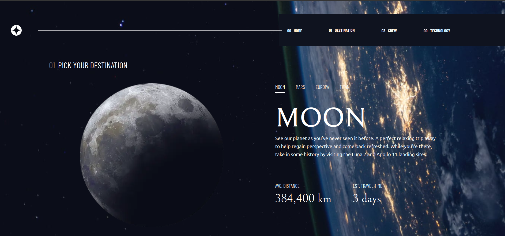
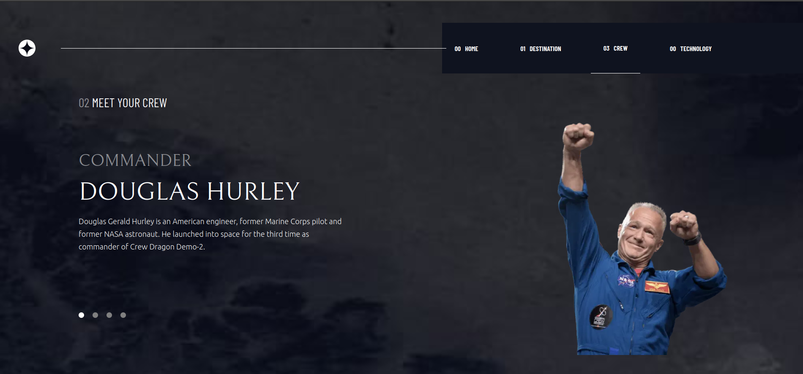
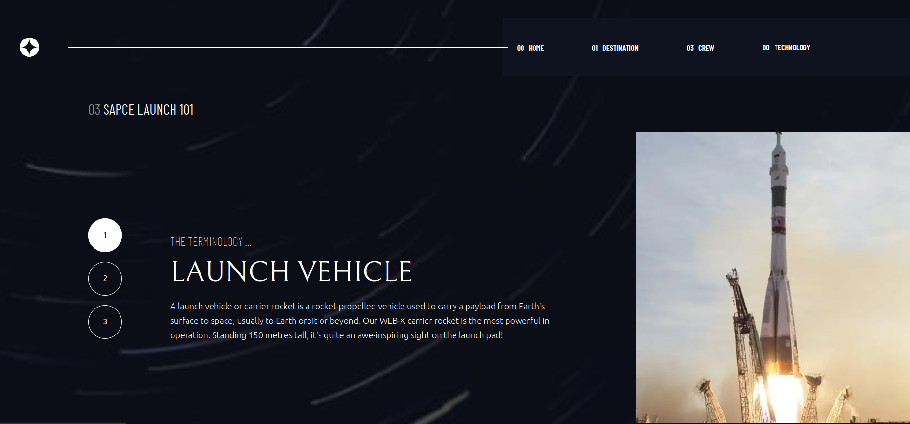

# Space Cadet

## About The App
This project shows information about space. It is a front end mentor challenge. The major take away from this project was the use of animations using `react-animation-on-scroll`. I aslo practiced my TypeScript.

## Screenshots

## Technologies
I used `React`, `TypeScript`, `Sass`, `React Animation on Scroll`

## Setup
- download or clone the repository
- run `npm install`
- run `npm run dev`

